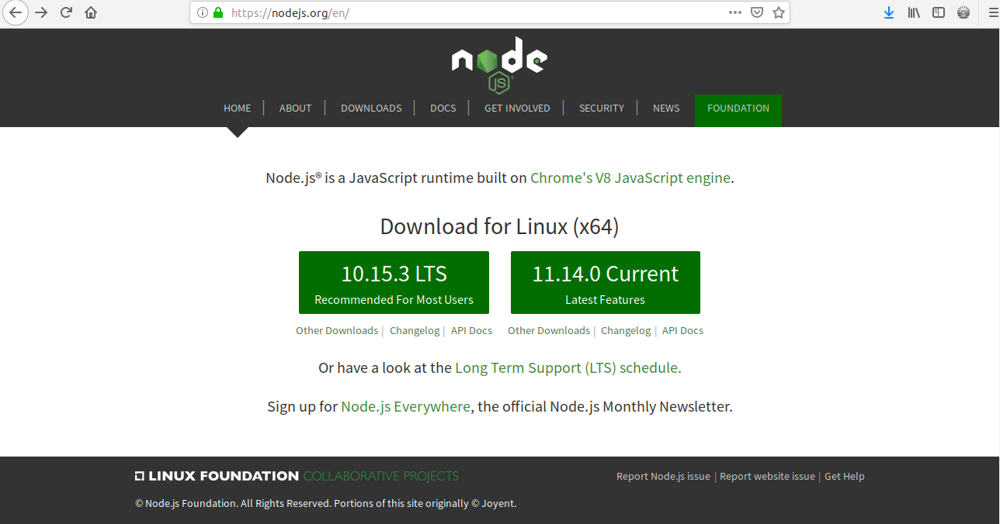
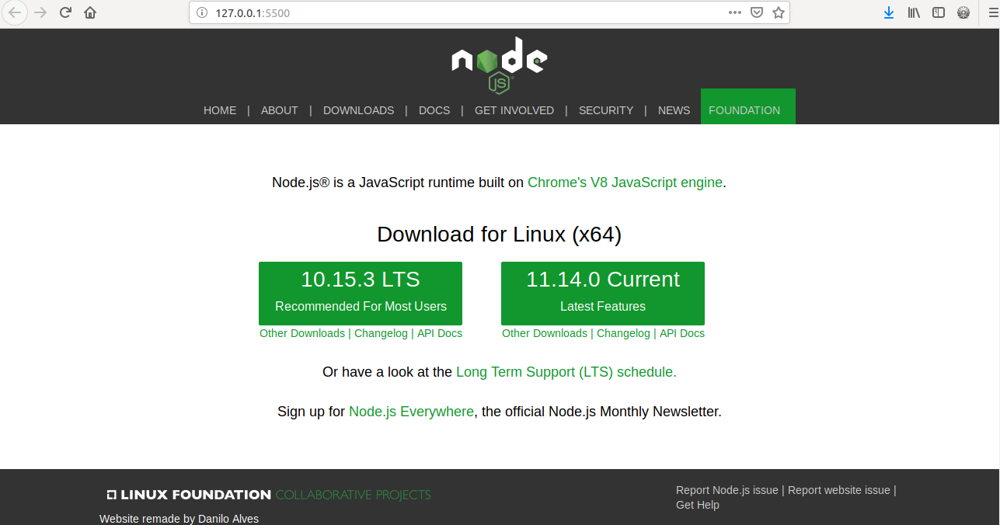

# Web Development Learning
Inside this GitHub repository you'll find some examples of what I've been learning and doing regarding web development.

## 1. Explanation
I started out learning web development a little while ago using a course on Udemy named [Web Design: Construa Sites com PHP, HTML, CSS e JavaScript](https://www.udemy.com/programacao-web-para-divulgacao-cientifica/) which now I have my progress on 45%.
Further, in a conversation I figured out a course, better and that teachs about real modern web development, so, that's where I'm at now. The course is [Curso Web Moderno com JavaScript 2019! COMPLETO + Projetos](https://www.udemy.com/curso-web/).

## 1.1 websitesremade folder
I remake some websites to test my skills and learn more, you can check them out inside this folder.

### 1.1.1 NodeJS Website (nodejs.org)
#### 1.1.1.1 Original Version


#### 1.1.1.2 Remade Version


## 1.1.2 Instagram Website (instagram.com)
### 1.1.2.1 Original Version


### 1.1.2.2 Remade Version


## 1.1.3 Facebook Website (facebook.com)
Still in development.

## 1.2 web folder 
Inside the web folder there are some html and css projects that I did alongside the first course.

## 1.3 course-webmoderno 
This folder holds the exercises and notes I've been doing following the second course.
### 1.3.1 Structure
As much of Udemy's courses, they are organized in sections and inside these sections there are the lessons. For example: 
```
Section 1 {
	Lesson 1
	Lesson 2
	Lesson 3
	Lesson 4
	...
}
...
```
So, it's easy to notice that I'm putting the name of the files according to the sections and lessons. Let's take as an example the fundamentals folder, it's name is:
```
section3_fundamentals
```
Inside this folder, the note/exercise about a certain lesson is explicitly told in the name of the file, for example, the lesson 50 is as showed below:
```
50errorTreatment.js
```
